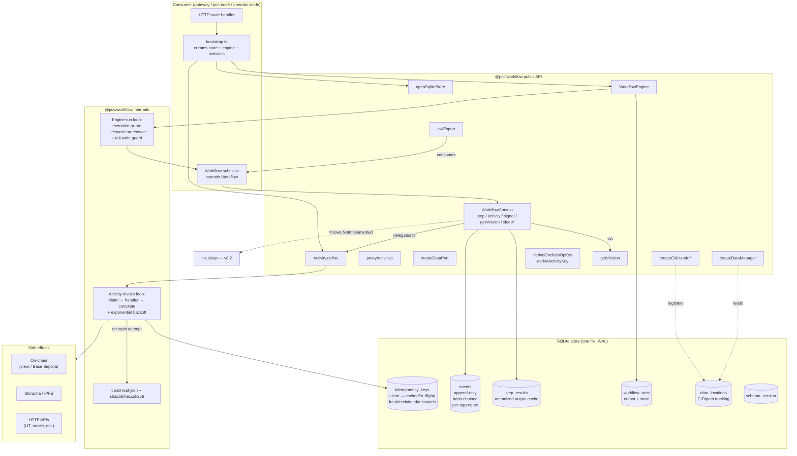

# PCC Workflow Runtime (`@pcc/workflow`)

> Repo-root deep dive on the durable-execution package that lives at `packages/workflow/`.
> Audience: PCC contributors who need to integrate, migrate to, or extend the runtime.

This document is the complement to [`packages/workflow/README.md`](../packages/workflow/README.md). The package README explains *how to use* the primitives. This document explains *why they exist*, *what they replace*, and *how to migrate code to them without breaking the gateway*.

If you have not already, also read:
- [`packages/workflow/README.md`](../packages/workflow/README.md) — public API + quick-starts.
- [`ai/research/pcc-workflow-runtime-design.md`](../ai/research/pcc-workflow-runtime-design.md) — 1,800-line architecture spec, the ground truth for every signature in the package.
- [`packages/workflow/examples/job-lifecycle.ts`](../packages/workflow/examples/job-lifecycle.ts) — runnable worked example mirroring the migration target.

---

## 1. Overview

`@pcc/workflow` is a library-only durable execution runtime. It embeds inside the existing PCC Fastify monolith (or `pcc-node`, or any other TS service) as an in-process dependency. There is no sidecar, no separate workflow server, no Redis, no Postgres requirement. One SQLite file is the entire moving part.

The runtime ships five primitives that map 1:1 to five concrete problems PCC has today.

### 1.1 The five problems each primitive solves

These map to the five "topics" the design doc is organized around (T1-T5).

| Problem (T#) | Today | What `@pcc/workflow` ships | Module |
|---|---|---|---|
| **T1 — Lost in-flight work on gateway restart.** `protocol-runner.ts` keeps `runs: Map<string, ProtocolRun>` in memory. A restart drops every active protocol mid-step. | In-memory Map → `ProtocolEvent` callback → drift between routes that read live state vs cached state. | `Workflow` abstract class + `WorkflowEngine` with crash-recovery (`engine.recover()`), backed by an append-only hash-chained `events` table per aggregate. Step-memoization (Inngest pattern) means resume short-circuits any step already cached in `step_results`. | `@pcc/workflow` |
| **T2 — Same on-chain tx fired twice by a retry.** `escrow.ts` calls `wallet.writeContract(...)` inline. If the response gets lost on the wire, the operator's retry replays the call and we double-fund (or worse, the escrow contract reverts after a chain reorg). | The in-memory idempotency middleware on `/api/escrow/quote`/`/simulate`/`/route` doesn't cover `/fund`/`/release`/`/dispute`. Stripe-style client `Idempotency-Key` header isn't honored. Semantic on-chain keys don't exist. | `Activity` wrapper with a 3-tier idempotency key (client header → semantic on-chain key via `deriveOnchainOpKey` → content hash). The semantic key is `keccak256(jobId, milestoneIdx, action, attempt=1)` so the smart contract's `executedOps` mapping deduplicates retries even across crashes. Exponential-backoff retry policy with `nonRetryableErrorPatterns`. | `@pcc/workflow` |
| **T3 — No durable cross-step data handoff.** Evidence bundle CIDs and intermediate sensor blobs flow as in-memory JS values. After a restart, downstream steps have no way to recover what the upstream step produced. | Implicit shared-process memory. Fragile to restarts, refactors, replicas. | `DataPort<T>` + `DataManager` + `CidHandoff` with a persistent `data_locations` table tracking CID/IPFS/local paths per port output. Locality-aware transfer routing: local-first, then peer, then chain anchor. Producer-consumer queue semantics with optional Zod schema validation. | `@pcc/workflow/data-port` |
| **T4 — No declarative export of a protocol DAG.** Compliance auditors and external research labs (Galaxy, nf-core, StreamFlow, Cromwell) ask for a portable workflow description; we have none. | Each protocol is implicit in TS code; auditors read source. | `cwlExport(workflowDef): string` — emits valid Common Workflow Language v1.2 YAML. Includes a `pcc:` namespace with our extension hints (`pcc:KernelRequirement`, `pcc:CompensationRequirement`, `pcc:QuorumRequirement`). | `@pcc/workflow/cwl` |
| **T5 — Can't safely change workflow code while runs are in flight.** A deploy that adds a step to a running workflow either (a) breaks the resume of in-flight runs, or (b) forces drain-before-deploy. | "Stop the world, deploy, restart" is the only option today. | `getVersion(key, defaultValue, currentValue)` — Temporal's marker-based pattern. First call from a fresh run emits a `VersionMarker` event and returns `currentValue`; replay of an older run reads the marker (or its absence) and returns `defaultValue` so the historic branch is preserved. | `@pcc/workflow` |

Everything else in the package — canonical JSON, sha256/keccak256 helpers, the `Result<T>` type, the SQLite schema, the retry-policy math — exists to support these five primitives.

---

## 2. Architecture

### 2.1 Component map



(`*` = `ctx.sleep` is declared on the public type but throws `NotImplementedError` in v0.1.)

### 2.2 Durability model in one paragraph

`WorkflowEngine.start(name, args)` derives a `runId` (random UUID, or deterministic from `(name, canonical(args))` if `findOrCreate`), inserts a `workflow_runs` row, and invokes `workflow.run(ctx, args)`. Inside the workflow body, every `ctx.step(id, fn)` call looks up `(runId, stepId)` in `step_results`. On hit, the cached value returns synchronously and `fn` does not execute. On miss, `fn` runs; on success the result is memoized; on failure the error bubbles up. A crash anywhere in the body leaves `workflow_runs.status = 'running'` with whatever steps had memoized; `engine.recover()` at the next boot re-instantiates the workflow class, calls `run` again, and every memoized step short-circuits — execution effectively resumes after the last memoized step. Activities ride on top of this: the engine calls `activity.invoke(...)`, which makes its own `idempotency_keys.claim(key, scope)` call — so a step that did `ctx.activity('fund-escrow', ...)` and crashed *between the on-chain submit and the memoize* gets at-least-once activity execution but exactly-once on-chain effect (because the semantic key collides on retry and the smart contract's `executedOps` mapping rejects the duplicate).

### 2.3 Event log shape

The `events` table satisfies ALCOA+ by construction:

- **Attributable** — every row has `actor_type` + `actor_id`.
- **Legible** — `payload` is canonical JSON, hashable.
- **Contemporaneous** — `occurred_at` (source clock) + `recorded_at` (gateway ingestion).
- **Original** — `kernel_signature` slot (filled when the verification pipeline lands).
- **Accurate** — `payload_hash` over canonical JSON; `event_hash` over `(prev_hash || payload_hash || event_order || event_type || aggregate_id || sequence)`.
- **+Consistent** — UNIQUE `(aggregate_type, aggregate_id, sequence)` prevents duplicate sequences; `verifyChain` walks the chain.
- **+Complete** — gap detection on read (sequence is strict 1..N per aggregate).
- **+Credible** — hash chain is replayable and verifiable.
- **+Enduring** — append-only; no UPDATE or DELETE on this table.
- **+Available** — accessible via the `EventStore` interface; optional `storage_cid` slot for IPFS pinning of the full event JSON.

Hashing deliberately excludes timestamps (which drift across machines) — only the monotonic `event_order` integer and content fields participate.

---

## 3. Adoption guide

### 3.1 Minimal adoption — wrap one risky call as an Activity

The smallest possible adoption: pick one HTTP route that does an on-chain or external HTTP call and put a wrapper around it. No workflow needed.

**Today** (`packages/gateway/src/routes/escrow.ts`, simplified):

```ts
fastify.post('/api/escrow/fund', async (req, reply) => {
  const { jobId, milestoneIdx, amount } = req.body as FundBody;
  try {
    const tx = await wallet.writeContract({
      address: ESCROW_ADDRESS,
      abi: MilestoneEscrowAbi,
      functionName: 'fund',
      args: [jobId, milestoneIdx, amount],
    });
    const receipt = await publicClient.waitForTransactionReceipt({ hash: tx });
    reply.send({ txHash: tx, blockNumber: Number(receipt.blockNumber) });
  } catch (err) {
    reply.status(502).send({ error: (err as Error).message });
  }
});
```

Two failure modes here: (1) gateway crash between `writeContract` and the `reply.send` — operator's HTTP retry replays the call and double-funds. (2) chain reorg between `writeContract` and `waitForTransactionReceipt` — we report the wrong block.

**Migration sketch** (don't apply this in this PR; this is a Phase 1 example):

```ts
// In packages/gateway/src/bootstrap.ts (run once at boot)
import { Activity, openSqliteStore, deriveOnchainOpKey } from '@pcc/workflow';

const workflowStore = openSqliteStore({
  path: process.env.WORKFLOW_DB_PATH ?? '/data/workflow.sqlite',
});

export const activities = {
  fundEscrow: Activity.define<readonly [`0x${string}`, number, bigint], TxReceipt>({
    name: 'fund-escrow',
    store: workflowStore,
    retryPolicy: {
      initialIntervalMs: 2_000,
      maximumAttempts: 7,
      nonRetryableErrorPatterns: ['EscrowAlreadyFundedError', 'InsufficientFundsError'],
    },
    handler: async ([jobId, milestoneIdx, amount]) => {
      const { key: opKey, scope } = deriveOnchainOpKey({ jobId, milestoneIdx, action: 'fund' });

      // Check if a prior attempt already submitted a tx for this semantic key
      const existing = await workflowStore.idempotency.lookup(opKey, scope);
      if (existing?.onchainTxHash) {
        return await escrow.waitForReceipt(existing.onchainTxHash);
      }

      const tx = await wallet.writeContract({
        address: ESCROW_ADDRESS,
        abi: MilestoneEscrowAbi,
        functionName: 'fund',
        args: [jobId, milestoneIdx, amount, opKey],   // contract takes opKey for executedOps
      });
      await workflowStore.idempotency.recordTx(opKey, scope, tx);
      return await publicClient.waitForTransactionReceipt({ hash: tx });
    },
  }),
};
```

```ts
// In the route handler — replaces the inline writeContract
fastify.post('/api/escrow/fund', async (req, reply) => {
  const { jobId, milestoneIdx, amount } = req.body as FundBody;
  const correlationId = (req.headers['x-correlation-id'] as string) ?? randomUUID();
  const actorId = req.headers['x-actor-id'] as string ?? 'system';

  const result = await activities.fundEscrow.invoke({
    workflowRunId: correlationId,
    activityId: `fund:${jobId}:${milestoneIdx}`,
    input: [jobId, milestoneIdx, amount],
    actorId,
    clientKey: req.headers['idempotency-key'] as string | undefined,
    httpMethod: 'POST',
    httpPath: '/api/escrow/fund',
  });

  if (!result.ok) {
    reply.status(502).send({ error: result.error.message });
    return;
  }
  reply.header('x-workflow-run-id', correlationId).send(result.value);
});
```

Diff summary:
- **Inline `writeContract`** → **`activities.fundEscrow.invoke({...})`**.
- **Error handling collapses** — no try/catch; the `Result<R, Error>` discriminated union is the failure surface.
- **HTTP API shape unchanged** — same body, same response, same status codes. The only addition is an `x-workflow-run-id` response header so clients can poll status.
- **Idempotency strengthened** — Stripe-style `Idempotency-Key` header is honored if present; if absent, the semantic on-chain key takes over.

### 3.2 Bigger adoption — replace `protocol-runner.ts` with a `Workflow`

This is Phase 2 of the migration plan. See [`examples/job-lifecycle.ts`](../packages/workflow/examples/job-lifecycle.ts) for a fully-worked equivalent. Key lift:

```ts
export class ProtocolWorkflow extends Workflow<ProtocolRun, ProtocolRun> {
  readonly name = 'ProtocolRun';
  readonly version = 1;

  async run(ctx: WorkflowContext, run: ProtocolRun): Promise<ProtocolRun> {
    for (const [idx, step] of run.steps.entries()) {
      await ctx.step(`step-${idx}-${step.id}`, async () => {
        return ctx.activity<readonly [string, ProtocolStep], unknown>(
          'execute-instrument-step', run.kernelId, step,
        );
      });
    }
    return { ...run, status: 'completed', endedAt: new Date().toISOString() };
  }
}
```

The event stream replaces `ProtocolRunner.eventListeners`: consumers subscribe via `store.events.readByType('ProtocolStepCompleted', sinceIso)` instead of attaching a callback.

### 3.3 New endpoint — CWL export

This is Phase 3. New route, no migration risk:

```ts
import { cwlExport } from '@pcc/workflow/cwl';
import { toWorkflowDef } from '../adapters/protocol-to-workflow-def.js';

fastify.get('/api/protocols/:id/cwl', async (req, reply) => {
  const { id } = req.params as { id: string };
  const template = await protocolRepo.get(id);
  if (!template) return reply.status(404).send({ error: 'not found' });
  const def = toWorkflowDef(template);
  return reply.type('application/yaml').send(cwlExport(def));
});
```

External labs running cwltool / Toil / StreamFlow / Galaxy can now consume PCC protocols without source access.

---

## 4. Migration phases

These are lifted verbatim from §11 of [`ai/research/pcc-workflow-runtime-design.md`](../ai/research/pcc-workflow-runtime-design.md). Wave 3 ships the package; the migrations land in follow-up PRs.

### Phase 1 — Wrap `escrow.ts` on-chain calls as Activities

**Goal**: make `POST /api/escrow/fund`, `/release`, `/dispute` crash-safe and idempotent with semantic on-chain keys.

- LOC estimate: ~300 LOC across 3 activity files + ~200 LOC of route changes.
- Test impact: escrow route tests mock the Activity engine instead of viem directly. Adds a small harness; each test gets shorter.
- Breaking change risk: **LOW**. HTTP shape unchanged. Adds `x-workflow-run-id` response header for polling; existing clients keep working.
- Who calls this: gateway routes; user agents via API; wizard session commit (`POST /api/negotiate/session/:id/commit`).
- Concrete change: see §3.1 above.

### Phase 2 — Replace `protocol-runner.ts` in-memory Map with EventStore-backed Workflow

**Goal**: lift `ProtocolRunner.runs: Map<string, ProtocolRun>` (`packages/orchestrator/src/protocol-runner.ts:24`) into a durable `Workflow` subclass.

- LOC estimate: ~500 LOC for `ProtocolWorkflow.ts` + ~300 LOC of adaptation in `protocol-runner.ts` + ~200 LOC bridging `InstrumentWorkflow` events to `ctx.step()` calls.
- Test impact: existing orchestrator tests need to seed a `Store` via `openSqliteStore({ path: ':memory:' })`. Each run becomes deterministic and inspectable — net win for testability.
- Breaking change risk: **MEDIUM**. `ProtocolEvent` semantics preserved, but in-flight runs on the old gateway can't seamlessly migrate. Mitigation: drain in-flight runs before deploying (short — protocol runs are minutes not days), document as a clean-slate cutover in release notes.
- Who calls this: `packages/gateway/src/routes/orchestrator.ts` via the facade layer. Also `packages/gateway/src/routes/protocols.ts` for template-driven runs. Both keep calling the same facade interface; routing through the workflow engine is internal.
- Concrete change: see §3.2 above.

### Phase 3 — CWL export endpoint at `/api/protocols/:id/cwl`

**Goal**: expose protocol templates as CWL v1.2 YAML for external labs and compliance auditors.

- LOC estimate: ~80 LOC for the route + ~50 LOC for the `ProtocolTemplate → WorkflowDef` adapter.
- Test impact: snapshot test on one representative template. Add contract test that emitted YAML parses with `cwl-ts-auto.loadDocument` (dev-dep only).
- Breaking change risk: **ZERO** — new endpoint.
- Who calls this: external research infrastructure; PCC's own export UI (future); compliance auditors.
- Optional companion: `POST /api/protocols/import/cwl` for the round-trip. Adds `cwl-ts-auto` as a gateway dev-dep.

### Phase 4 — Optional Merkle audit log

Further out. Add a Merkle tree index over `events.event_hash` tuples; publish a Signed Tree Head daily on-chain. Enables third-party inclusion proofs without trusting the PCC gateway. Deferred until a regulatory audit partner asks for it.

---

## 5. Operational notes

### 5.1 SQLite path — the one piece of deployment config

`@pcc/workflow` does **not** read environment variables itself. The consuming service (gateway, operator-node, pcc-node) decides where the file lives.

**Recommended convention**:

```ts
// In packages/gateway/src/bootstrap.ts (similar for other services)
const workflowStore = openSqliteStore({
  path: process.env.WORKFLOW_DB_PATH ?? '/data/workflow.sqlite',
});
```

**Railway**: `/data` is **not** persistent by default. Mount a volume and set `WORKFLOW_DB_PATH=/app/data/workflow.sqlite` (or wherever the volume is mounted) **before** any consumer of `@pcc/workflow` ships. See [`docs/DEPLOY.md`](./DEPLOY.md) for the relevant runbook entry.

**pcc-node** (Python operator CLI): currently doesn't consume `@pcc/workflow` directly. When a TS sidecar is added, default to `${XDG_DATA_HOME}/pcc-node/workflow.sqlite` or `~/.pcc-node/workflow.sqlite`.

**Tests**: pass `path: ':memory:'` for a per-test instance.

### 5.2 Backup

The SQLite file is the system of record for in-flight workflow state and idempotency dedup. Treat it as production data.

- **Hot backup**: `sqlite3 workflow.sqlite ".backup '/tmp/workflow.sqlite.bak'"` is consistent with WAL mode. The hourly TTL pruner does not interfere.
- **Cold backup**: stop the process (or call `await store.close()`) before copying the file directly.
- **Off-site**: ship the backup to S3/Storacha on a cron. The whole file is typically <100 MB even with months of history (events are small JSON; idempotency rows TTL out).

### 5.3 Vacuum and growth

The store TTL-prunes `idempotency_keys` hourly via an unref'd `setInterval` registered in `openSqliteStore`'s constructor. **The `events` table is append-only and never pruned** — it's the audit log.

Estimated growth:
- 1 KB per event (canonical JSON + indexes + hash-chain overhead).
- A typical PCC protocol run emits 5-20 events.
- 10k runs/month × 15 events × 1 KB = 150 MB/month of `events` growth.

If `events` grows beyond 10 GB, archive to Storacha (write the full event JSON to a CID, set `events.storage_cid`, then `DELETE FROM events WHERE storage_cid IS NOT NULL AND recorded_at < <cutoff>`). This is a manual operation; no helper ships in v0.1.

`VACUUM` reclaims freed pages — run on a quarterly cron during a maintenance window.

### 5.4 Observability hooks

The store doesn't emit telemetry on its own. Wire your existing OTLP exporter at the consumer:

```ts
const startedAt = Date.now();
const result = await activities.fundEscrow.invoke({...});
otelMeter.recordHistogram('activity.duration_ms', Date.now() - startedAt, {
  activity: 'fund-escrow', ok: String(result.ok),
});
```

A future minor version may add a `Store` event-emitter for store-level metrics. Not in v0.1.

---

## 6. Performance

> **TBD: bench in v0.2.** The Wave 3 implementer focused on correctness and test coverage; no formal benchmarks were captured. Order-of-magnitude expectations from the design doc + scout reports:

- **Activity invoke (cache miss, in-process handler)**: low ms — dominated by handler latency. Idempotency claim/complete adds ~1ms each on better-sqlite3 in WAL mode.
- **Activity invoke (cache hit)**: sub-ms (single SELECT on `idempotency_keys`).
- **Workflow step (memoized)**: sub-ms (single SELECT on `step_results`).
- **Workflow step (fresh)**: dominated by the `fn` body + one INSERT into `step_results`.
- **Event append**: ~1ms (hash compute + INSERT under `BEGIN IMMEDIATE` for serialized writes).
- **Recovery (`engine.recover()` at boot)**: linear in the number of incomplete `workflow_runs`. For typical PCC workloads (<100 in-flight at any time) this should be <1s.
- **SQLite write throughput**: better-sqlite3 in WAL mode handles 10-50k single-row inserts/sec on commodity hardware. PCC at hackathon scale is ≤10/sec — vast headroom.

If benchmarks land in v0.2 they'll go in `packages/workflow/bench/` and be referenced from this section.

---

## 7. FAQ

### Q1. When should I wrap something as an `Activity` vs. just call it inline?

Wrap as an Activity when **any** of these are true:
- The call has a side effect that's expensive or dangerous to repeat (on-chain tx, payment, evidence upload, external API write).
- You want crash-recovery and exactly-once semantics across retries.
- You need a Stripe-style client `Idempotency-Key` to deduplicate operator retries.
- You want the call to be retried automatically with exponential backoff.
- You want a typed `Result<R, Error>` failure surface instead of try/catch.

Don't bother for read-only HTTP calls, pure functions, or calls so cheap that retries are free. The overhead is one SQLite INSERT + one SELECT per invoke; for sub-ms operations it's not worth the indirection.

### Q2. What replays on crash?

Everything inside `workflow.run(ctx, args)` re-executes from the top — workflow code is **not** snapshotted. The durability comes from:

1. **`ctx.step(id, fn)` calls** that completed before the crash short-circuit on resume because `step_results` has the cached value. The lambda does **not** re-run.
2. **`ctx.activity(name, ...args)` calls** that completed before the crash short-circuit on resume because `idempotency_keys.claim(...)` returns `outcome: 'cached'`. The handler does **not** re-run.
3. **`ctx.signal(name)` calls** that already received their payload short-circuit because the `WorkflowSignalReceived` event has been persisted; on resume, the engine drains the in-memory queue before re-entering the workflow body.

**Concretely:** if your workflow body is `await ctx.step('A', fnA); await ctx.step('B', fnB); await ctx.step('C', fnC);` and the gateway crashes after `fnB` completes but before `fnC` starts, recovery will replay the body, find A and B already memoized (skip both), and execute C from scratch.

**Caveats:**
- Code outside `ctx.step` / `ctx.activity` (loops, conditionals, variable assignment) re-runs every replay. Keep workflow body deterministic.
- A handler that crashed mid-execution will be re-tried; a handler whose result was lost between completion and memoize is also re-tried. Both cases are at-least-once.

### Q3. Can I run two workflows concurrently against the same store?

Yes. better-sqlite3 in WAL mode serializes writes at the file level (and event appends use `BEGIN IMMEDIATE` to claim the exclusive write lock atomically), but reads are concurrent. Two workflow runs can interleave their step executions freely; their `step_results` rows are partitioned by `runId`, so there's no contention.

If you start two workflows with the same `(name, canonical(args))` and `findOrCreate: true`, they collapse to the same `runId` — only one actually runs. Without `findOrCreate`, you get two distinct runs (random UUIDs).

What you cannot do safely on v0.1: **run multiple gateway processes against the same SQLite file**. SQLite tolerates it but the engine's in-memory `running` map and signal queues are per-process. Cross-process signal delivery is the v0.2 work item (`SignalRouter` extension point).

### Q4. How do I roll back a workflow whose code is buggy?

Three layers:

1. **Stop new runs**. Remove the `engine.register(BadWorkflow)` call in your bootstrap and redeploy. New `engine.start('BadWorkflow', ...)` calls error out as "not registered." Existing in-flight runs continue.
2. **Cancel in-flight runs**. Use `handle.cancel(reason)` for each `runId` you want to halt. The workflow body is not interrupted mid-step (cooperative cancellation), but waiters on `ctx.signal(...)` reject with `WorkflowCancelled`, and the run transitions to `status='cancelled'` on the next yield point.
3. **Re-introduce a fixed version**. Increment `version` on the class, re-register, and start new runs against the fixed code. Old `runId`s remain `cancelled` / `failed`; new runs get a fresh `runId`.

For a *partial* rollback (one branch of one workflow), use `getVersion`:

```ts
const v = await ctx.getVersion('use-new-fund-flow', 0, 1);
if (v === 1) await ctx.activity('fund-escrow-v2', ...);
else         await ctx.activity('fund-escrow-v1', ...);
```

In-flight runs that started before the marker existed see `defaultValue=0` and follow the v1 branch; new runs see `currentValue=1` and follow v2. See §10 of the design doc.

### Q5. Can a Workflow call another Workflow?

Not in v0.1 — `WorkflowContext` does not expose `startChild()`. The workaround is to call `engine.start(...)` from inside a `ctx.step`:

```ts
await ctx.step('start-subprocess', async () => {
  const child = await engine.start<ChildArgs, ChildResult>('Child', childArgs);
  const result = await child.result();
  if (!result.ok) throw result.error;
  return result.value;
});
```

This works but **lineage isn't tracked** — `workflow_runs.parent_run_id` exists in the schema but no API populates it from this pattern. Children show up as independent root workflows. The v0.2 `ctx.startChild()` API will populate `parent_run_id` and surface the lineage in `engine.recover()`.

---

## 8. See also

- [`packages/workflow/README.md`](../packages/workflow/README.md) — package public API + 3 quick-starts.
- [`packages/workflow/CHANGELOG.md`](../packages/workflow/CHANGELOG.md) — release notes (Unreleased until release-please tags v0.1.0).
- [`packages/workflow/examples/job-lifecycle.ts`](../packages/workflow/examples/job-lifecycle.ts) — runnable worked example.
- [`ai/research/pcc-workflow-runtime-design.md`](../ai/research/pcc-workflow-runtime-design.md) — full 1,800-line architecture spec; ground truth for every signature in the package.
- [`CLAUDE.md`](../CLAUDE.md) — `## RECOMMENDED: Workflow Runtime` section is the entry point for new code.
- [`docs/DEPLOY.md`](./DEPLOY.md) — Railway volume + `WORKFLOW_DB_PATH` operational note.
