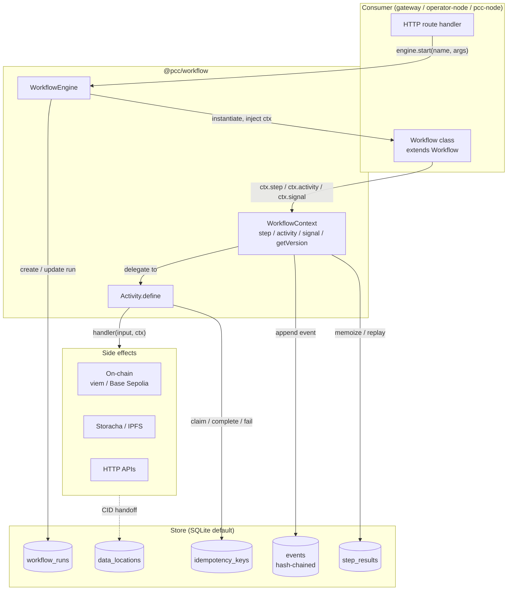

# @pcc/workflow

> Durable execution primitives for the Physical Capability Cloud — embeddable in any TypeScript Fastify monolith, no separate workflow server required.

`@pcc/workflow` is a library-only, SQLite-backed durable-execution package. It borrows the Inngest step-memoization model, layers on a Temporal-style `Activity` ABI, and adds the bits PCC actually needs (semantic on-chain idempotency keys, hash-chained ALCOA+ audit log, federated `DataPort` handoff, CWL export). It ships ~1,400 LOC of source, runs in-process, and depends only on `better-sqlite3`, `yaml`, `zod`, and `@pcc/spec`.

**Status:** v0.1.0 — preview release on `feat/workflow-runtime`. **Not yet merged**; not yet wired into any consumer route. Consumers should wait for Phase 1 of the migration plan (see [docs/WORKFLOW_RUNTIME.md](../../docs/WORKFLOW_RUNTIME.md)) before adopting.

---

## Why

The PCC gateway today ships several patterns that look like durable execution but are not:

| Today | Failure mode |
|-------|--------------|
| `protocol-runner.ts` keeps `runs: Map<string, ProtocolRun>` in memory | Lost on gateway restart. |
| `escrow.ts` `wallet.writeContract(...)` inline | Crash mid-tx → operator can't tell whether to retry. |
| In-memory idempotency middleware on three routes | TTL ticks once a process; replicas don't share state. |
| Evidence upload retries are ad-hoc | Same content uploaded N times to Storacha. |
| No replayable audit log of business events | ALCOA+ Enduring/Available checks are best-effort. |

`@pcc/workflow` packages five primitives — `Activity`, `Workflow`, `EventStore`, `DataPort`, `getVersion`/`cwlExport` — that solve those five problems with one SQLite file and ~1,400 LOC of code review.

---

## What ships in v0.1

| Primitive | Module | One-line |
|-----------|--------|----------|
| `Activity` | `@pcc/workflow` | Idempotent wrapper for side-effecting calls (HTTP, on-chain, evidence upload). Exponential backoff, 3-tier idempotency key, semantic on-chain key helper. |
| `Workflow` + `WorkflowEngine` | `@pcc/workflow` | Inngest-style step-memoization. Crash mid-step → resume picks up after the last memoized step. |
| `Store` + `openSqliteStore` | `@pcc/workflow` | Pluggable persistence. Default SQLite adapter implements all five sub-stores (idempotency, events, steps, runs, data locations). |
| `DataPort`, `DataManager`, `CidHandoff` | `@pcc/workflow/data-port` | Typed inputs/outputs with content-addressable handoff (Storacha CID, IPFS, etc). No shared filesystem assumption. |
| `getVersion` | `@pcc/workflow` | Marker-based versioning so workflow code can evolve without rewriting in-flight runs. |
| `cwlExport` | `@pcc/workflow/cwl` | Serialize a `WorkflowDef` as Common Workflow Language v1.2 YAML for interop with cwltool / Toil / StreamFlow / Galaxy. |

**What does NOT ship in v0.1** (see [Limitations](#limitations) and [CHANGELOG.md](./CHANGELOG.md)):

- `ctx.sleep(id, ms)` — throws `NotImplementedError`. Durable timers land in v0.2.
- Child workflows (`startChild`) — `workflow_runs.parent_run_id` column exists; API does not.
- Per-step `timeoutMs` — bound by `RetryPolicy.maximumAttempts` for now.
- Cross-process signal delivery — single-process only.

These are intentionally deferred. Wave 3 ships the primitives 100% tested; the migrations and the missing features land in follow-up PRs (see §11 of the design doc and the migration roadmap below).

---

## Install

```bash
pnpm add @pcc/workflow
```

The package is internal to the monorepo (`workspace:*`). Consumers reference it as a workspace dep:

```jsonc
// packages/<your-package>/package.json
{
  "dependencies": {
    "@pcc/workflow": "workspace:*"
  }
}
```

Top-level entry point re-exports everything. Subpath exports exist (`./activity`, `./workflow`, `./data-port`, `./cwl`, `./store-sqlite`) for tree-shaking and clarity, but the barrel is fine for typical use.

---

## Quick start

### Use case 1 — wrap a single side-effect as an idempotent Activity

This is the smallest possible adoption: take one risky HTTP/on-chain call and put a retry + dedup wrapper around it. No workflow needed.

```ts
import { Activity, openSqliteStore } from '@pcc/workflow';

const store = openSqliteStore({ path: '/data/workflow.sqlite' });

const sendEmail = Activity.define<readonly [string, string], { messageId: string }>({
  name: 'send-email',
  store,
  retryPolicy: {
    initialIntervalMs: 1_000,
    maximumAttempts: 5,
    nonRetryableErrorPatterns: ['InvalidEmailError', 'BlockedSenderError'],
  },
  handler: async ([to, body], ctx) => {
    return mailer.send({ to, body, idempotencyKey: ctx.idempotencyKey });
  },
});

// Anywhere you would have called `await mailer.send(...)`, call this instead:
const result = await sendEmail.invoke({
  workflowRunId: correlationId,    // or any per-request UUID
  activityId: `email:${userId}:${campaignId}`,
  input: ['user@example.com', 'Welcome!'],
  actorId: `agent:${agentId}`,
});

if (!result.ok) {
  reply.status(502).send({ error: result.error.message });
  return;
}
reply.send(result.value);
```

What you get for free:
- **Same input twice → same response.** The second call hits the dedup cache and never invokes `mailer.send` again.
- **Crash recovery.** If the gateway dies between `mailer.send` and the dedup write, the retry sees `status='processing'` past the stuck window and reclaims it (fencing-token semantics).
- **Bounded retries.** `maximumAttempts` + `backoffCoefficient` ride on top of every call.
- **Failure surfaces as `Result<R, Error>`.** No try/catch boilerplate at every call site.

### Use case 2 — compose Activities into a crash-safe Workflow

The full job-lifecycle example. Lives in [`examples/job-lifecycle.ts`](./examples/job-lifecycle.ts) and exercises every public primitive.

```ts
import {
  Activity,
  Workflow,
  WorkflowEngine,
  openSqliteStore,
  deriveOnchainOpKey,
  type WorkflowContext,
} from '@pcc/workflow';

const store = openSqliteStore({ path: process.env.WORKFLOW_DB_PATH ?? '/data/workflow.sqlite' });

// 1. Define activities
const fundEscrow = Activity.define<readonly [`0x${string}`, number, bigint], TxReceipt>({
  name: 'fund-escrow',
  store,
  retryPolicy: { initialIntervalMs: 2_000, maximumAttempts: 7, nonRetryableErrorPatterns: ['EscrowAlreadyFundedError'] },
  handler: async ([jobId, milestoneIdx, amount]) => {
    const { key: opKey } = deriveOnchainOpKey({ jobId, milestoneIdx, action: 'fund' });
    const tx = await escrow.fund({ jobId, milestoneIdx, amountUsdc: amount, opKey });
    return escrow.waitForReceipt(tx.hash);
  },
});

// 2. Compose into a workflow
class JobLifecycle extends Workflow<JobArgs, JobResult> {
  readonly name = 'JobLifecycle';
  readonly version = 1;

  async run(ctx: WorkflowContext, args: JobArgs): Promise<JobResult> {
    const fundReceipt = await ctx.step('fund-escrow', () =>
      ctx.activity<readonly [`0x${string}`, number, bigint], TxReceipt>(
        'fund-escrow', args.jobId, args.milestoneIdx, args.amount,
      ),
    );

    const evidenceCid = await ctx.step('upload-evidence', () =>
      ctx.activity<readonly [string], string>('upload-evidence', args.bundleCid),
    );

    // External signal — operator approval. Workflow pauses durably until delivered.
    const approval = await ctx.signal<{ approver: string; ok: boolean }>('approved');
    if (!approval.ok) throw new Error('ApprovalRejectedError');

    const release = await ctx.step('release-milestone', () =>
      ctx.activity<readonly [`0x${string}`, number, string], TxReceipt>(
        'release-milestone', args.jobId, args.milestoneIdx, evidenceCid,
      ),
    );

    void fundReceipt;
    return { txRelease: release.hash, evidenceCid };
  }
}

// 3. Bootstrap (gateway startup)
const engine = new WorkflowEngine({ store, activities: { 'fund-escrow': fundEscrow, /* ... */ } });
engine.register(JobLifecycle);
await engine.recover();   // resume any incomplete runs from a previous boot

// 4. Start a run
const handle = await engine.start<JobArgs, JobResult>('JobLifecycle', {
  jobId: '0xabc...' as `0x${string}`,
  milestoneIdx: 0,
  amount: 100_000n,
  bundleCid: 'bafy...',
});

// Later, deliver the operator approval signal
await handle.signal('approved', { approver: 'op:0x...', ok: true });

// Wait for completion
const result = await handle.result();
if (result.ok) console.log('done', result.value);
```

What durability buys you:
- **Crash between steps → resume.** `engine.recover()` at boot finds incomplete `workflow_runs`, replays the workflow body, and short-circuits any step that already wrote to `step_results`.
- **Per-aggregate hash-chained event log.** Every signal, step start, step complete writes to `events` with a `prev_hash` link, satisfying ALCOA+ Enduring/Credible by construction.
- **External signals are queued.** `handle.signal('approved', ...)` works whether the workflow is currently awaiting it or not yet at that step. Drain happens automatically.
- **Find-or-create runs.** Pass `findOrCreate: true` to dedupe runs on `(workflow_name, canonical(args))` — useful when an HTTP route shouldn't double-start a workflow on retry.

### Use case 3 — export a workflow as CWL v1.2 YAML

Useful for compliance auditors and external research infrastructure that runs PCC protocols on cwltool / Toil / StreamFlow / Galaxy.

```ts
import { cwlExport, type WorkflowDef } from '@pcc/workflow/cwl';

const def: WorkflowDef = {
  id: 'job-lifecycle',
  cwlVersion: 'v1.2',
  inputs: [
    { id: 'jobId', type: 'string' },
    { id: 'amount', type: 'long' },
  ],
  outputs: [
    { id: 'txRelease', type: 'string', outputSource: 'release-milestone/txHash' },
  ],
  steps: [
    { id: 'fund-escrow', run: '#fund-escrow', in: { jobId: 'jobId', amount: 'amount' }, out: ['txHash'] },
    { id: 'upload-evidence', run: '#upload-evidence', in: { bundleCid: 'bundleCid' }, out: ['cid'] },
    { id: 'release-milestone', run: '#release-milestone', in: { jobId: 'jobId', cid: 'upload-evidence/cid' }, out: ['txHash'] },
  ],
  hints: [
    { class: 'pcc:KernelRequirement', kernelTypes: ['evm-base-sepolia'] },
    { class: 'pcc:CompensationRequirement', refundOnFailure: true },
  ],
};

const yaml = cwlExport(def);
// → emits valid CWL v1.2 YAML with the pcc: namespace declared inline
```

The output passes `cwl-ts-auto.loadDocumentFromString` for downstream tools that want to re-import it.

---

## Configuration

`@pcc/workflow` itself reads no environment variables. **Consumers** are responsible for choosing a SQLite path and passing it in. The recommended pattern, mirrored in the migration plan and DEPLOY.md:

| Variable | Owner | Description | Default |
|----------|-------|-------------|---------|
| `WORKFLOW_DB_PATH` | gateway / operator-node bootstrap | Absolute path passed to `openSqliteStore({ path })`. On Railway this MUST point at a mounted volume (e.g. `/data/workflow.sqlite`) — the default Railway filesystem is ephemeral and a restart wipes the file. | _none_ — caller decides |
| `IDEMPOTENCY_TTL_MS` | gateway middleware | TTL for the existing in-memory idempotency Map. **Not consumed by `@pcc/workflow`** — this package uses scope-driven TTLs (24h for `http:`, 30d for `onchain:`, 7d for `workflow:`, sentinel for `evidence:`). Listed for completeness. | 86400000 (24h) |

The package does not write to disk on import — the file is opened lazily when `openSqliteStore` is called. In tests, pass `path: ':memory:'` for a per-test instance.

`openSqliteStore` accepts a small options bag; defaults are tuned for Railway-class hosts (single writer, WAL mode, hourly TTL prune):

```ts
openSqliteStore({
  path: '/data/workflow.sqlite',
  pruneIntervalMs: 60 * 60 * 1000,   // 1h — set to 0 to disable auto-prune
  // The store will also accept an injected better-sqlite3 instance for testing
});
```

---

## Architecture



**Durability model in one sentence:** every `ctx.step()` looks up `(runId, stepId)` in `step_results`; on hit it returns the cached value without invoking the lambda; on miss it runs and memoizes. A crash between lambda completion and memoize is replayed (at-least-once per step). Activities are exactly-once *given the same idempotency key*; semantic on-chain keys make replays safe even across crashes.

---

## Limitations

These are documented in the design doc (§12) and the [CHANGELOG.md](./CHANGELOG.md). Listed here so adopters can plan around them:

| Limitation | Workaround in v0.1 | Lands in |
|------------|--------------------|----------|
| `ctx.sleep(id, ms)` throws `NotImplementedError` | Use `setTimeout` inside `ctx.step()` for non-durable delays. | v0.2 — durable timer poller (~100 LOC). |
| No child workflows | Compose by calling `engine.start` from one `ctx.step`; lineage isn't tracked yet. | v0.2 — `ctx.startChild()`. |
| Single-process signal delivery | Shard your gateway by `runId` if you must scale horizontally. | v0.2 — Postgres `LISTEN/NOTIFY` or Redis pub/sub via `SignalRouter` extension point. |
| No per-activity `timeoutMs` | Bound execution via `RetryPolicy.maximumAttempts` + your own `Promise.race`. | v0.1.1 — `Activity.define({ timeoutMs })`. |
| SQLite write-throughput cap | At PCC scale (single Railway gateway, hundreds of jobs/day) this is irrelevant. Evaluate Postgres adapter at >1k writes/sec. | When needed — `Store` interface is already pluggable. |

---

## Testing

```bash
pnpm -F @pcc/workflow test
```

146 tests across 15 files. All run on Spark via `spark-run "cd ~/projects/physical-capability-cloud && pnpm -F @pcc/workflow test"` — the local 16GB tablet OOMs on parallel `better-sqlite3` builds.

Tests cover:
- canonical JSON + sha256/keccak256 deterministic hashing
- SQLite store schema + WAL mode + all five sub-stores
- idempotency lifecycle: claim → complete, claim → reclaim stuck, mismatch, TTL prune
- event store: append + hash chain integrity + per-aggregate read + verifyChain
- step result memoization
- activity define + retry math + non-retryable patterns + 3-tier key derivation + on-chain semantic key
- workflow engine: register → start → step → activity → signal → resume after crash
- data-port: put / get / close / backpressure / CID handoff
- versioning: marker emission + replay branch selection
- CWL export: snapshot + namespace correctness

---

## See also

- **[docs/WORKFLOW_RUNTIME.md](../../docs/WORKFLOW_RUNTIME.md)** — repo-root deep dive: architecture, adoption guide, migration phases, FAQ.
- **[ai/research/pcc-workflow-runtime-design.md](../../ai/research/pcc-workflow-runtime-design.md)** — full 1,800-line design doc (the ground truth for what shipped).
- **[examples/job-lifecycle.ts](./examples/job-lifecycle.ts)** — worked example wired with stub clients; reference for migrations.
- **[CHANGELOG.md](./CHANGELOG.md)** — release notes (`Unreleased` until release-please cuts a tag).
- **[CLAUDE.md](../../CLAUDE.md)** — top-level project doctrine; the `## RECOMMENDED: Workflow Runtime` section points new code here.
